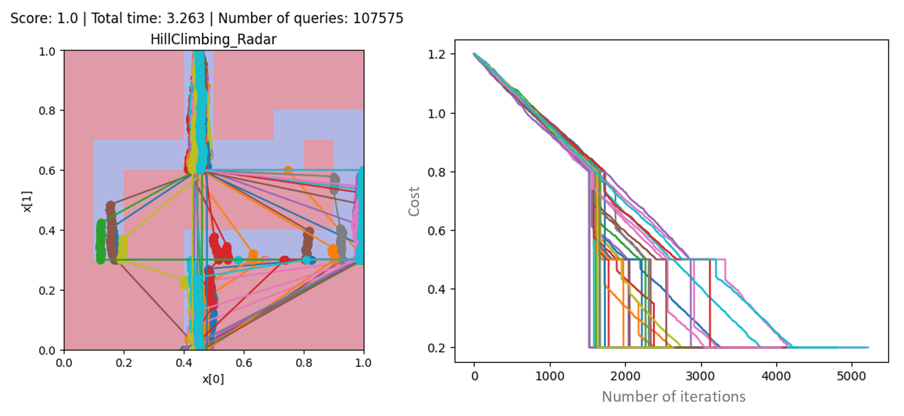

# Heuristic Playground

These are the scripts I used to generate the maze experiments of Chapter 3 of my master's thesis. Feel free to use it for your own experiments, or to compare the existing metaheuristic evasion attacks with your owns. Please not that those experiments were conducted before the publication of the VEA package, and that the code was optimized since then. You would probably need to adapt the existing code to your needs. For more information, please refer to the thesis.